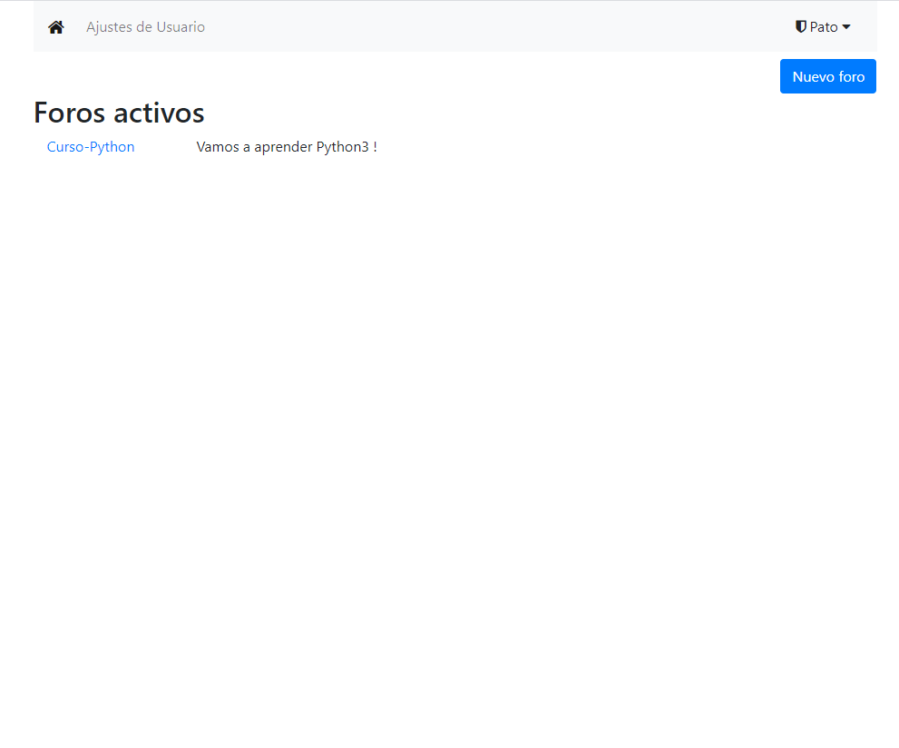
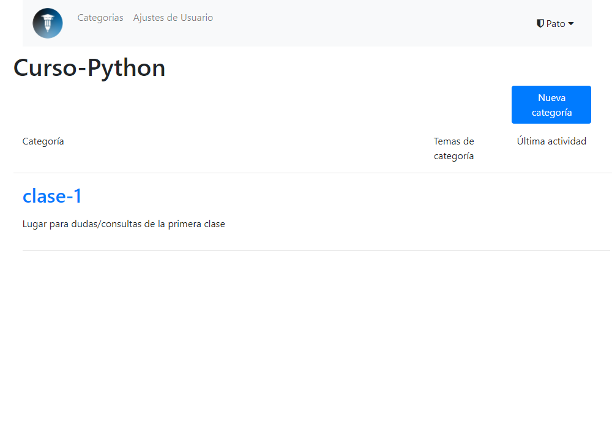

# curso: a saloon homage
A place to chat and communicate. Basically, a forum.
---
This is a [Buffalo](https://gobuffalo.io/) application based heavily on the excellent
but now derelict [go-saloon/saloon](https://github.com/go-saloon/saloon).

It uses Postgres SQL database and OAuth2 using goth.

Thanks to Sebastian Binet and the go-saloon authors for providing a sturdy foundation for this forum app.

## Looks

### Homepage

### Categories

### Topics

### Replies on topic


## How to run application

One needs a database to run `curso`.
Here is an example, running postgres inside a docker container:

```
$> docker run --name curso-postgres -e POSTGRES_PASSWORD=1337 -p 5432:5432 -d postgres
```

### Create Your Databases

Ok, so you've edited the "database.yml" file and started postgres, now Buffalo can create the databases in that file for you:

```
$> buffalo pop create -a
```

You can run `buffalo pop migrate` to initialize the forum and the content of its database:


### Starting the Application

Buffalo ships with a command that will watch your application and automatically rebuild the Go binary and any assets for you.
That's useful when developing on `saloon`.
To do that run the "buffalo dev" command:

```
$> buffalo dev
```

If you point your browser to [http://127.0.0.1:3000](http://127.0.0.1:3000) you should see a "Welcome to the Saloon Forum" page.

## how i did this
Don't bother reading this. These are notes for myself if I ever try building a new buffalo app in the future.

`buffalo new curso` then `cd curso`


`buffalo pop g model user name nick provider provider_id email role subscriptions`
-> modify `models/user.go` -> change subscriptions to `slices.UUID` type. change
all types that are not fit for default datatype.

migration for `users`
```
create_table("users") {
    t.Column("id", "uuid", {primary: true})
    t.Column("name", "string", {})
    t.Column("nick", "string", {})
    t.Column("provider", "string", {})
    t.Column("provider_id", "string", {})
    t.Column("email", "string", {})
    t.Column("role", "string", {})
    t.Column("subscriptions", "varchar[]", {"null": true})
    t.Timestamps()
}
add_index("users", ["provider", "provider_id", "role"], {"unique":true})
```
`buffalo pop migrate`

Same goes for other db tables. `buffalo pop g model forum title description logo defcon staff`. db type for `[]byte` is `blob`


npm gotta have python and c++ build tools for `node-sass`, don't ask me why, windows sucks. Run following in powershell in admin mode
```
npm install -g node-gyp
npm install --global --production windows-build-tools
```


